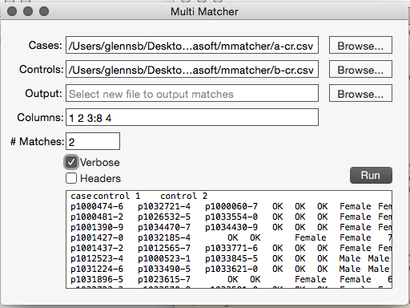

# Multi Matcher

A (rough/quick) GUI for [mmatcher](https://github.com/oklasoft/mmatcher).
**Multi Matcher** is a return to Cocoa development since Project Builder
& Interface Builder were two separage programs. It also represents my first
attempt at playing with Swift

[mmatcher](https://github.com/oklasoft/mmatcher) is used to join two files
based on multiple matches between selected columns

## Installation

The repository has no external dependencies & can be cloned & built if desired.

Alternatively, a pre-built .app can be found in the [latest releases](releases/latest)

Once you have the .app, just copy it to where you like to keep apps.

## Usage

**Multi Matcher** requires two CSV files to match and one or more data columns upon which
to join. CSV files are required to have an *identifer* as the first column, each ID should be
unique within & between the two files. Data columns can then be anything you want after that.
Results will be best if the two files have their data columns in the same order. The first file
is the *cases* & the second the *controls*. Each case ID is matched to at least 1 control ID.

If an output file is named, results will be saved there as a CSV. If no output file is given,
results will instead be presented as tab delimited text in the bottom field. This allows for
rapid testing of columns & even copy paste of the final results into a spreadsheet application.
Default output is to report all records from the cases file & matching record(s) from the control
file.

Matching keys/columns are specified in the *Columns* text fiied by the column number, starting
at 1, after the ID column. The first column of data (the second overall column in the file) is
number 1, then 2, then 3, etc. All columns are matched if their contents exactly equal, unless
you specify a range for the column by appending :# to the key, where # is a number to use for
the +/- range. Of course that only really works if the data columns compared are numbers too.

The *# Matches* field can be used to attempt to find multiple possible matches for each ID from
the *cases* file. No ID from the *controls* file will be reused. A case is given first dibs on a
matching control as its first match before that control is allowed to be used as an additional.

The *Verbose* check enables/disables verbose output. Verbose output includes the matching data
columns in the results. Default (non verbose) output is to only return the *casae* the matching
*control(s)*

The *Headers* check is used if the input files include a header row. If enabled the first row
of each input file will be skipped.

## License

Copyright 2015 Stuart Glenn, Oklahoma Medical Research Foundation (OMRF)

This package is distributed under a 3 clause BSD license. See [LICENSE](LICENSE)
included with this distribution for complete details.
